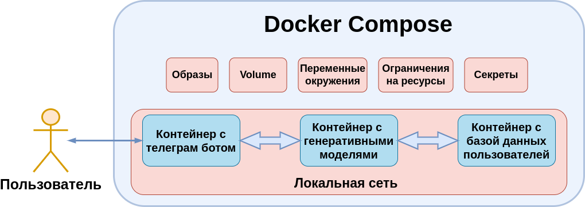

# Стилизованный генератор текстов

Развлекательный сервис генерирующий продолжение сообщения пользователя в различных стилистиках. Сервис доступен в виде телеграм бота https://t.me/logiczmaksimka_bot, который поддерживает 2 модели для генерации:

* Бот Волк - обучавшийся на мемах с "волчьими цитатами"
* Бот Пушкин - обучавшийся на собрании стихов Пушкина

## Структура проекта


## Запуск
Для запуска приложения нужно в корне проекта запустить команду

```bash
docker-compose up
```

Для использования приложения в своём телеграм-боте нужно обновить токен **telegram_bot/token.txt**

## Требования к железу

Запуск приложения сопровождается установкой тяжеловесных пакетов (в особенности pytorch) и скачиваением моделей общим весом около 6 Gb.

* При запуске на CPU:
    * Для стабильной работы приложения может потребоваться вплоть до 8 Gb оперативной памяти
    * Время генерации одного сообщения при использовании бота "Волк" не более 3 секунд и вплоть до 30 секунд при генерации длинных сообщений ботом "Пушкин"
* При запуске на GPU:
    * Требуется около 5G памяти